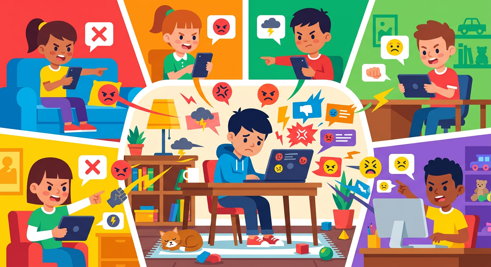

# Кибербуллинг

**ID:** cyberbullying  
**WikiData:** [Q1065052](https://www.wikidata.org/wiki/Q1065052)  
**Раздел:** 5.2. Кибербезопасность и поведение в сети  

💡 **Коротко:** Агрессивное поведение и травля человека в интернете через сообщения и социальные сети.

## Введение

Интернет — это отличное место для общения, игр и учебы. Но, к сожалению, иногда люди ведут себя там очень зло и жестоко. Кибербуллинг — это травля, оскорбления и угрозы, которые происходят в цифровом мире: в социальных сетях, мессенджерах или онлайн-играх. В отличие от обычной ссоры во дворе, кибербуллинг страшен тем, что он может происходить круглосуточно, а обидчики часто прячутся за выдуманными именами и аватарками, чувствуя свою безнаказанность.

## Как распознать кибербуллинг

Травля в интернете может принимать самые разные и неприятные формы. Важно уметь их замечать:

- **Оскорбления и угрозы:** Злые комментарии под фотографиями, обидные сообщения в личку или угрозы физической расправы.
- **Распространение слухов:** Создание фальшивых страниц или публикация лживой информации, чтобы опозорить человека перед друзьями.
- **Бойкот в сети:** Намеренное исключение человека из общих чатов, групп или совместных онлайн-игр, чтобы он почувствовал себя одиноким.
- **Кража личности:** Взлом аккаунта (если у тебя слабый [пароль](password.md)) и рассылка гадостей от твоего имени.

## Примеры из жизни

Кибербуллинг часто начинается с мелочей, но может быстро перерасти в серьезную проблему:

- **Травля в онлайн-игре:** Ты зашел поиграть в командную игру, но случайно совершил ошибку. Другие игроки начинают кричать на тебя в голосовой чат, обзывать и писать гадости в общий чат, заставляя тебя выйти из игры.
- **Злые мемы:** Кто-то из одноклассников сделал неудачную фотографию с тобой, добавил обидную надпись и разослал по всем школьным чатам. Все смеются, а тебе очень обидно.
- **Анонимные угрозы:** Тебе начинают приходить сообщения с неизвестных номеров или пустых аккаунтов с угрозами и требованиями удалить свою страничку.

## Как защититься и что делать

Если ты столкнулся с кибербуллингом, главное правило — **не молчи и не отвечай агрессией на агрессию**. 

1. **Блокируй:** Сразу отправляй обидчика в "черный список" (бан).
2. **Сохраняй доказательства:** Делай скриншоты переписок и обидных комментариев.
3. **Расскажи взрослым:** Обязательно поделись проблемой с родителями или учителями, они помогут разобраться.
4. **Защити аккаунты:** Настрой свою [приватность](privacy.md) так, чтобы тебе могли писать только друзья, и включи [двухфакторную аутентификацию](2fa.md).

## Заключение

Кибербуллинг — это серьезное нарушение твоих границ и безопасности. Никто не имеет права оскорблять тебя в интернете. Помни, что твой [цифровой след](digital_footprint.md) остается навсегда, поэтому старайся сам быть вежливым в сети и не поддерживай тех, кто травит других. Интернет должен быть безопасным местом для всех!