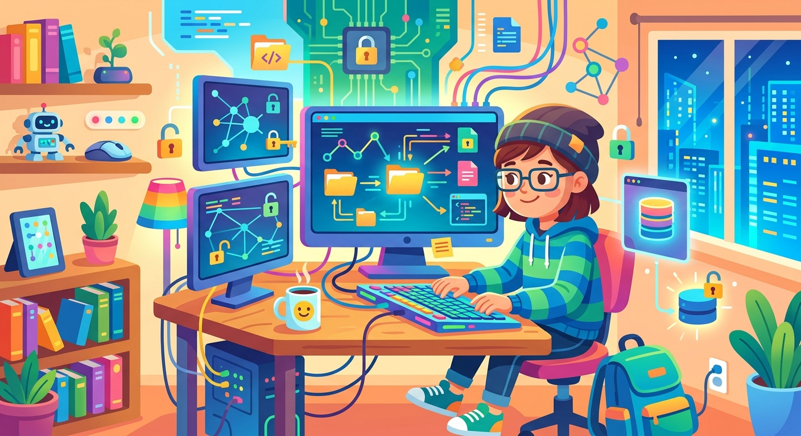

# Хакер

**ID:** hacker  
**WikiData:** [Q1487](https://www.wikidata.org/wiki/Q1487)  
**Раздел:** 5.2. Кибербезопасность и поведение в сети  

💡 **Коротко:** Компьютерный специалист, ищущий уязвимости в системах защиты данных.

## Введение

В интернете есть люди, которые досконально, на уровне сложного программного кода, разбираются в том, как работают компьютеры, операционные системы и глобальные сети. Таких высококвалифицированных специалистов называют хакерами. Важно понимать, что далеко не все они плохие: существуют "белые" хакеры, которые официально работают в крупных компаниях и легально ищут ошибки, чтобы сделать программы безопаснее для всех нас. А вот злоумышленники (или "черные" хакеры) используют свои обширные знания для того, чтобы незаконно добыть чужие секреты, обойти защиту и заработать на этом деньги.

## Инструменты и методы взломщиков

Современный хакер редко сидит в темной комнате и угадывает пароли вручную, нажимая кнопки. У профессионалов есть целый арсенал сложных цифровых хитростей:

- Они пишут разрушительные [вирусы](virus.md), чтобы автоматизировать массовые атаки на миллионы устройств.
- Они виртуозно используют методы "социальной инженерии", отправляя обманчивый [фишинг](phishing.md) и организуя изощренный [спам](spam.md), чтобы заставить человека добровольно отдать свои данные.
- Они детально собирают чужой [цифровой след](digital_footprint.md), изучая профили в соцсетях, чтобы подобрать ответы на секретные вопросы для восстановления пароля.
- Они постоянно ищут бреши и невидимые дыры в коде устаревших программ, поэтому для защиты так критически важно своевременное [обновление](update.md).

## Примеры из жизни

Взломщики интересуются не только банками и крупными корпорациями. Школьники часто становятся их мишенями:

- **Кража игровых аккаунтов:** В играх вроде Roblox или Fortnite мошенники часто притворяются администраторами или создают фальшивые сайты, обещая бесплатную игровую валюту (робуксы или в-баксы). Если ты введешь туда свой [логин](login.md) и [пароль](password.md), хакер мгновенно заберет твой аккаунт и перепродаст его.
- **Шантаж в социальных сетях:** Злоумышленник может взломать твою страничку ВКонтакте и начать рассылать от твоего имени сообщения твоим друзьям с просьбой срочно перевести деньги на его счет.

## Первый случай в истории

Интересно, что самый первый в истории хакерский взлом произошел задолго до появления интернета и персональных компьютеров! В 1903 году знаменитый физик Гульельмо Маркони демонстрировал публике свой новый беспроводной телеграф, уверяя всех в его абсолютной защищенности. Однако британский фокусник и талантливый инженер Невил Маскелайн смог перехватить радиосигнал. Прямо во время презентации он послал через аппарат Маркони шуточные оскорбления, доказав всему миру уязвимость новой технологии.

## Заключение

Чтобы твоя личная [приватность](privacy.md) не пострадала от рук злоумышленников, тебе необходимо выстроить крепкую и многоуровневую оборону. Твоим надежным щитом станут [менеджер паролей](password_manager.md), строгая [двухфакторная аутентификация](2fa.md), активный [антивирус](antivirus.md) и использование защищенного [VPN](vpn.md). А на крайний случай всегда имей актуальное [резервное копирование](backup.md) своих файлов.
---
Автор: Радион Никита, использовано: Gemini 3.1 Pro, Nano Banana 2
