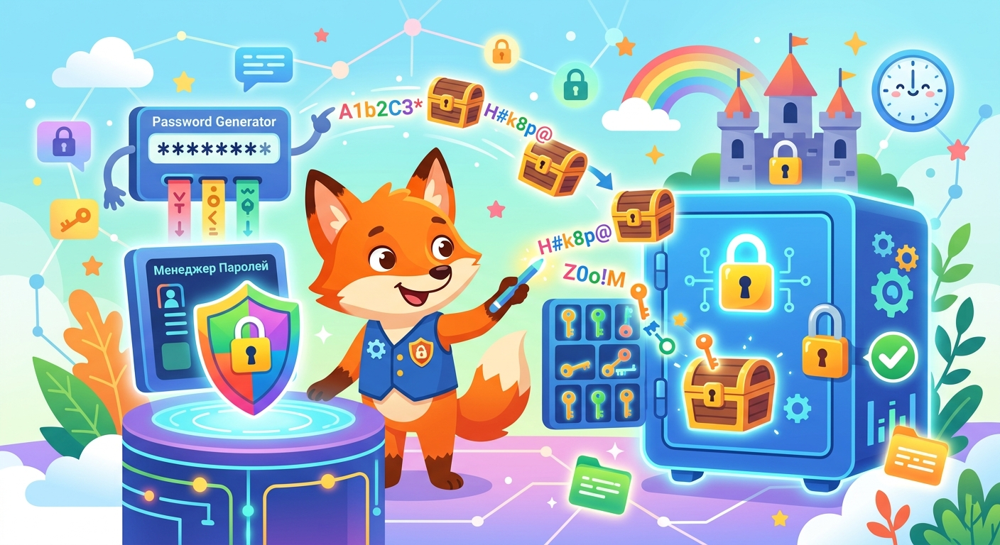

# Менеджер паролей

**ID:** password_manager  
**WikiData:** [Q1281199](https://www.wikidata.org/wiki/Q1281199)
**Раздел:** 5.2. Кибербезопасность и поведение в сети  

💡 **Коротко:** Программа для безопасного создания и зашифрованного хранения паролей.

## Введение

Представь, что ты нашел настоящую пиратскую пещеру, и в ней стоят десятки сундуков с сокровищами. От каждого сундука есть свой уникальный сложный ключ. Носить их все в кармане тяжело, а запомнить, какой ключ от какого замка — просто невозможно для человеческого мозга. Менеджер паролей — это специализированная программа, которая работает как гигантский бронированный цифровой сейф. Она надежно хранит абсолютно все твои [пароли](password.md) и [логины](login.md) в одном безопасном и зашифрованном месте.

## Как устроен цифровой сейф

Использование такой программы делает твое пребывание в интернете в сто раз удобнее и безопаснее. Тебе больше не нужно напрягать память. Вот три главных этапа работы с этой технологией:

1. **Создание мастер-пароля:** Тебе нужно придумать и запомнить всего один самый главный, длинный и очень сложный пароль. Именно он открывает саму базу данных (сейф).
2. **Умная генерация ключей:** Когда ты регистрируешься на новом сайте, менеджер сам создает случайный набор из 15-20 символов (например, k9$Fg2@pLx!8qZ). Тебе даже не нужно его запоминать или пытаться прочитать.
3. **Безопасное автозаполнение:** При входе на нужный сайт программа сама подставляет твои данные в нужные поля. Это превосходно спасает от [фишинга](phishing.md), так как сейф физически не сможет вставить пароль на поддельный сайт мошенников, у которого отличается адрес, даже если ты сам не заметил обмана.

## Примеры из жизни

В современной жизни у школьника скапливается огромное количество аккаунтов.

- **Школа и учеба:** Аккаунт от электронной почты, электронного дневника, платформ для онлайн-олимпиад и изучения языков.
- **Развлечения:** Профили в Steam, Epic Games, Roblox, Minecraft, Discord, YouTube и TikTok.
- **Риски:** Если ты будешь записывать пароли от этих сервисов в обычный бумажный блокнот, кто угодно сможет его открыть, пока ты отошел на перемену. Бумажку легко потерять. Менеджер паролей решает эту проблему навсегда, сохраняя все в твоем телефоне под мощным криптографическим замком.

## Локальное или облачное хранение

Существуют разные подходы к хранению твоих секретов. Некоторые менеджеры по умолчанию хранят зашифрованную базу данных только в виде файла на твоем собственном жестком диске, никуда ее не отправляя. Это обеспечивает максимальную [приватность](privacy.md). Другие современные сервисы (например, 1Password) хранят зашифрованный сейф на сверхзащищенных серверах в интернете. Это позволяет тебе легко синхронизировать свои пароли между мобильным телефоном и домашним компьютером, используя для передачи [HTTPS](https.md). База защищается алгоритмами вроде PBKDF2, которые специально замедляют попытки подобрать главный пароль перебором.

## Заключение

Использование менеджера паролей — это лучший и самый современный способ защитить свой [цифровой след](digital_footprint.md). Чтобы злоумышленники не смогли добраться до твоего цифрового сейфа, установи хороший [мастер-пароль](password.md), избегай скачивания [вирусов](virus.md), регулярно выполняй [обновления](update.md) и обязательно настраивай [двухфакторную аутентификацию](2fa.md) для сейфа.
---
Автор: Нургалиев Даниэль, использовано: Gemini 3.1 Pro, Nano Banana 2
