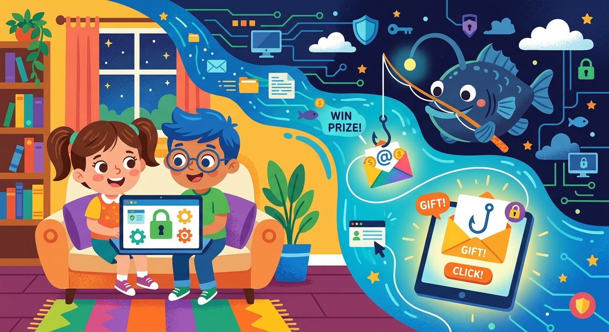

# Фишинг

**ID:** phishing  
**WikiData:** [Q135005](https://www.wikidata.org/wiki/Q135005)  
**Раздел:** 5.2. Кибербезопасность и поведение в сети  

💡 **Коротко:** Вид интернет-мошенничества для получения доступа к конфиденциальным данным пользователей.

## Введение

В реальной жизни ловкие мошенники могут переодеться в официальную униформу сотрудника банка или почтальона, чтобы обманом втереться к тебе в доверие и узнать твои секреты. В огромном интернете эта коварная тактика переодевания называется фишингом (слово произошло от английского fishing — рыбная ловля). Злоумышленники забрасывают виртуальную "наживку" в виде невероятно похожих поддельных сайтов и писем, чтобы заставить тебя своими руками отдать им твои ключи.

## Сценарий классического обмана

Как правило, фишинговая атака проходит по очень предсказуемому, но пугающе эффективному сценарию:

1. **Заброс удочки:** Ты неожиданно получаешь тревожное письмо или назойливый [спам](spam.md) с текстом вроде: «Ваш игровой аккаунт заблокирован! Срочно подтвердите вашу личность, иначе мы удалим его навсегда». Негативные эмоции и страх заставляют человека паниковать и действовать быстро, отключая логику.
2. **Переход по ссылке:** Ты поспешно кликаешь по предложенной ссылке и попадаешь на сайт, который по дизайну выглядит точь-в-точь как настоящая страница известной социальной сети.
3. **Кража:** Не замечая подвоха, ты вводишь свой секретный [логин](login.md) и [пароль](password.md). Эти данные никуда не входят, а мгновенно, прямым текстом отправляются [хакеру](hacker.md).

## Примеры из жизни

Школьники очень часто сталкиваются с фишингом в развлекательных сферах:

- **Бесплатные подарки:** Ты видишь рекламу в YouTube: "Введи свои данные от аккаунта Roblox на нашем сайте и получи 10,000 робуксов бесплатно!". Конечно, это обман. Настоящие разработчики игр никогда не просят твой пароль.
- **Поддельные голосования:** Тебе пишет знакомый (чей профиль уже взломали): "Привет, проголосуй за меня в конкурсе рисунков, вот ссылка". Ты переходишь, а там сайт просит авторизоваться через ВКонтакте. Ты вводишь данные, и твой аккаунт тоже угоняют.

## Иллюзия безопасности

Многие люди ошибочно верят, что если в верхней адресной строке браузера уютно горит зеленый замочек, то сайт абсолютно безопасен. На самом деле, этот замочек означает лишь наличие базового [HTTPS](https.md) (протокол шифрования). Мошенники сегодня очень легко и бесплатно получают сертификаты шифрования на свои поддельные сайты с [фишингом](phishing.md), поэтому просто зеленый замочек сам по себе больше не гарантирует полную безопасность!

## Заключение

Главное оружие против фишинга — это твоя внимательность. Никогда не переходи по подозрительным ссылкам. Великолепную автоматическую защиту от фишинга обеспечивает [менеджер паролей](password_manager.md) — он просто не станет заполнять поля, если увидит чужой адрес сайта. Обязательно используй [антивирус](antivirus.md), установи фильтры для блокировки вредоносных [спам-писем](spam.md), сохраняй своего [цифрового следа](digital_footprint.md) в тайне, скрывай трафик через [VPN](vpn.md) и вовремя делай [резервные копии](backup.md) вместе с [2FA](2fa.md).
---
Автор: Романов Вадим, использовано: Gemini 3.1 Pro, Nano Banana 2
