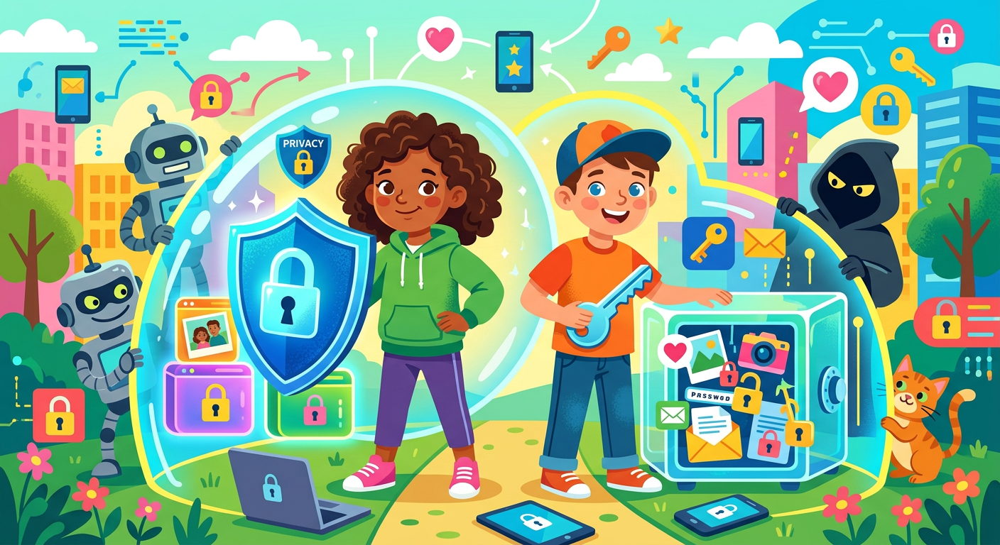

# Приватность

**ID:** privacy  
**WikiData:** [Q188728](https://www.wikidata.org/wiki/Q188728)  
**Раздел:** 5.2. Кибербезопасность и поведение в сети  

💡 **Коротко:** Право человека на сохранение в тайне своей личной информации и контроль доступа к ней.

## Введение

В реальной жизни ты точно не станешь рассказывать свои самые сокровенные секреты и диктовать домашний адрес абсолютно каждому встречному незнакомцу на улице. В огромном и часто опасном интернете приватность (или конфиденциальность) выполняет точно ту же защитную функцию. Это твое законное, неотъемлемое право жестко контролировать, какая именно информация о тебе доступна другим людям, глобальным корпорациям и поисковым алгоритмам.

## Цена бесплатных сервисов

Многие пользователи часто задаются справедливым вопросом: почему популярные социальные сети, поисковики и видеохостинги абсолютно бесплатны для нас? Ответ прост, но суров: в современном цифровом мире товаром являешься ты сам, а точнее, твои бесценные данные. Крупные технологические компании круглосуточно собирают твой активный и пассивный [цифровой след](digital_footprint.md) (что ты лайкаешь, где бываешь, что покупаешь в магазинах) и продают эту агрегированную информацию рекламным агентствам. Именно поэтому так критически важно ограничивать доступ к своему профилю и очень осознанно подходить к любой публикации личной информации в сети.

## Примеры из жизни

Как защищать свои границы каждый день:

- **Настройки социальных сетей:** В твоем профиле ВКонтакте или Instagram есть меню "Настройки приватности". Обязательно сделай так, чтобы твои фотографии и список друзей видели только те люди, которых ты знаешь лично. Не добавляй в друзья незнакомцев.
- **Фотографии билетов:** Если ты с родителями летишь в отпуск или идешь на концерт, никогда не выкладывай фото билета с читаемым штрихкодом. Любой человек в интернете сможет скопировать этот код и забрать твой билет себе.
- **Геолокация:** Отключай определение местоположения в камере телефона. Иначе любой человек сможет узнать точные GPS-координаты места, где была сделана твоя фотография.

## Правила личных границ

Чтобы обезопасить себя и свою семью от киберугроз, соблюдай базовые, но очень эффективные правила:

- Никогда не публикуй свой точный домашний адрес, номер телефона и не делись геолокацией в реальном времени.
- Используй уникальный и сложный [пароль](password.md) для каждого сервиса, на котором регистрируешься.
- Если вся твоя жизнь выставлена напоказ, злому [хакеру](hacker.md) будет очень легко подготовить идеальную ловушку для [фишинга](phishing.md) или прислать тебе вредоносный [вирус](virus.md).

## Заключение

Скрывай свой интернет-трафик с помощью [VPN](vpn.md) и всегда проверяй наличие [HTTPS](https.md) при вводе данных. Храни доступы только в зашифрованном [менеджере паролей](password_manager.md) и повсеместно используй [двухфакторную аутентификацию](2fa.md). Чтобы надежно защитить архивы от вредоносных программ, установи современный [антивирус](antivirus.md), делай [резервные копии](backup.md) и не забывай про регулярное [обновление](update.md).
---
Автор: Соловьева Надежда, использовано: Gemini 3.1 Pro, Nano Banana 2
