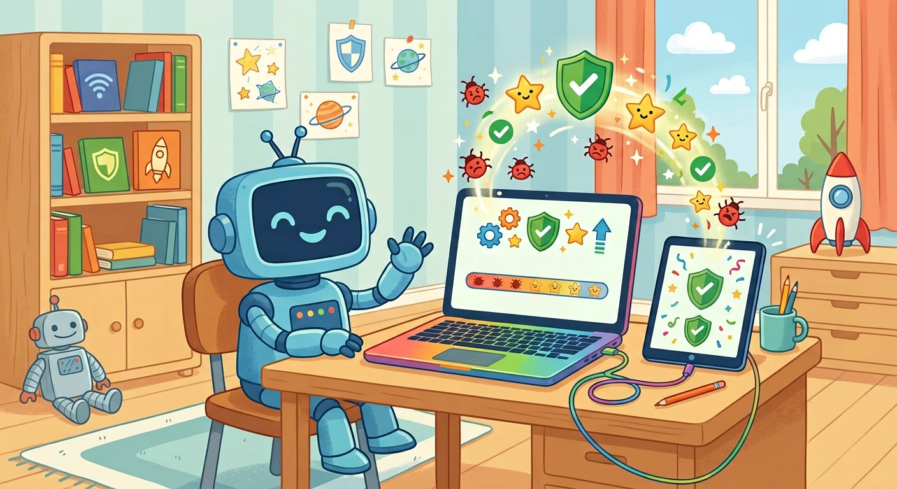

# Обновление системы

**ID:** update  
**WikiData:** [Q15852209](https://www.wikidata.org/wiki/Q15852209)  
**Раздел:** 5.2. Кибербезопасность и поведение в сети  

💡 **Коротко:** Установка новых версий программного обеспечения для исправления ошибок и закрытия уязвимостей.

## Введение

Любая, даже самая качественная и дорогая программа в мире, состоит из миллионов строк кода и неизбежно содержит скрытые недочеты. Со временем разработчики, или специальные тестировщики, находят эти слабые места и выпускают обновления (или так называемый патч). Это критически необходимый цифровой "ремонт", который оперативно латает опасные дыры в стенах твоей компьютерной виртуальной крепости, не давая врагам проникнуть внутрь.

## Зачем нужен цифровой ремонт

Многие пользователи сильно раздражаются и часто намеренно игнорируют всплывающие на экране окна с просьбой обновить систему или перезагрузить телефон, считая это пустой тратой времени. Но делать этого категорически нельзя по трем очень важным причинам:

1. **Экстренное закрытие уязвимостей:** Подавляющее большинство обновлений направлены именно на устранение невидимых брешей в коде, которые коварный [хакер](hacker.md) мог бы легко использовать для скрытой кражи твоей личной информации.
2. **Актуализация защиты:** Твой установленный [антивирус](antivirus.md) никак не сможет обнаруживать новые угрозы, если ты не будешь регулярно скачивать для него свежие базы данных. Без них он просто не будет знать, как выглядит свежий, выпущенный вчера [вирус](virus.md).
3. **Улучшение работы:** Помимо важной безопасности, обновления часто добавляют новые полезные функции и заметно ускоряют стабильную работу устройства.

## Примеры из жизни

Посмотрим, к чему приводит игнорирование красных уведомлений:

- **Обновление игр:** Если ты вовремя не обновишь клиент популярной онлайн-игры, сервер просто не пустит тебя внутрь, потому что твоя версия кода отличается от серверной.
- **Обновление смартфона:** Когда телефон просит перезагрузиться ночью для установки обновления iOS или Android, лучше согласиться. Если ты будешь откладывать это месяцами, мошенники смогут использовать старые уязвимости в твоем браузере, чтобы украсть твои пароли.

## Угрозы нулевого дня

В напряженном мире кибербезопасности существует пугающее понятие «уязвимость нулевого дня» (zero-day exploit). Это такие опасные дыры в программном коде, о которых сами разработчики еще даже не подозревают, но злоумышленники уже активно ими пользуются для взлома серверов. Когда эксперты по безопасности наконец обнаруживают такую страшную брешь, компании в экстренном порядке, работая по ночам, выпускают "патч безопасности". Если ты не установишь его вовремя, твои [логины](login.md), секретный [пароль](password.md) и вся твоя [приватность](privacy.md) окажутся под прямой угрозой.

## Заключение

Постоянное и регулярное обновление абсолютно всех программ — это фундамент твоей защиты. Оно великолепно работает в едином комплексе с надежным [менеджером паролей](password_manager.md) под непробиваемой [2FA](2fa.md). Чтобы сохранить свой [цифровой след](digital_footprint.md) в чистоте, всегда используй [VPN](vpn.md), полностью игнорируй мошеннический [фишинг](phishing.md) и [спам](spam.md), включай [HTTPS](https.md) в кафе и делай контрольное [резервное копирование](backup.md) всех файлов перед установкой самых крупных системных апдейтов.
---
Автор: Федорова Екатерина, использовано: Gemini 3.1 Pro, Nano Banana 2
