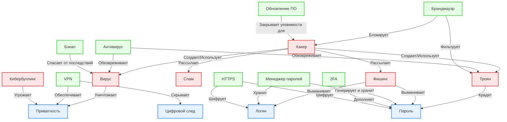

# Лабораторная работа: Кибербезопасность и поведение в сети (Раздел 5.2)

В данной директории представлены рабочие материалы группы, отвечающей за раздел "Кибербезопасность и поведение в сети" для детской энциклопедии KidBook.

## 1. Концептуализация предметной области

Для построения базы знаний мы выделили 18 ключевых понятий, которые были разделены на три основные логические категории (классы):

1.  **Киберугрозы (Threats):** Хакер, Вирус, Троян, Фишинг, Спам, Кибербуллинг.
2.  **Средства защиты (Defenses):** Антивирус, Брандмауэр (Файрвол), Резервное копирование (Backup), Обновление ПО, VPN, HTTPS, Менеджер паролей, Двухфакторная аутентификация (2FA).
3.  **Идентификация и личные данные (Identity & Data):** Логин, Пароль, Приватность, Цифровой след.

## 2. Онтология графа знаний (Mermaid)

Ниже представлена визуализация нашей онтологии. Граф демонстрирует как иерархические связи (принадлежность к классу), так и **горизонтальные связи** (взаимодействие объектов друг с другом, например: "Антивирус обезвреживает Вирус", "Фишинг выманивает Пароль").

## 3. Описание связей

В нашей онтологии реализованы следующие типы связей:
*   **Атакующие связи (красные узлы):** Направлены от угроз к личным данным. Показывают векторы атак (кража, выманивание, уничтожение).
*   **Защитные связи (зеленые узлы):** Направлены от средств защиты к угрозам (блокировка, обезвреживание) или к данным (шифрование, скрытие, хранение).
*   **Структурные связи:** Показывают зависимость одних технологий от других (например, 2FA дополняет Пароль).

## 4. Автоматизация и скрипты

В данной директории также находятся скрипты, использованные для автоматизации работы:
*   `wikidata.py` — извлекает фактологические данные из WikiData (Action API) по Q-ID концептов и сохраняет их в `knowledge_graph.json`.
*   `generate.py` — использует LLM API для генерации текстов статей в формате Markdown и API генерации изображений для создания иллюстраций.
*   `link.py` — скрипт, который автоматически находит упоминания концептов в текстах и расставляет перекрестные ссылки. Скрипт избегает самоцитирования и поломки Markdown-разметки.
*   `sparql.txt` — набор SPARQL-запросов для извлечения и визуализации подграфов знаний из WikiData.